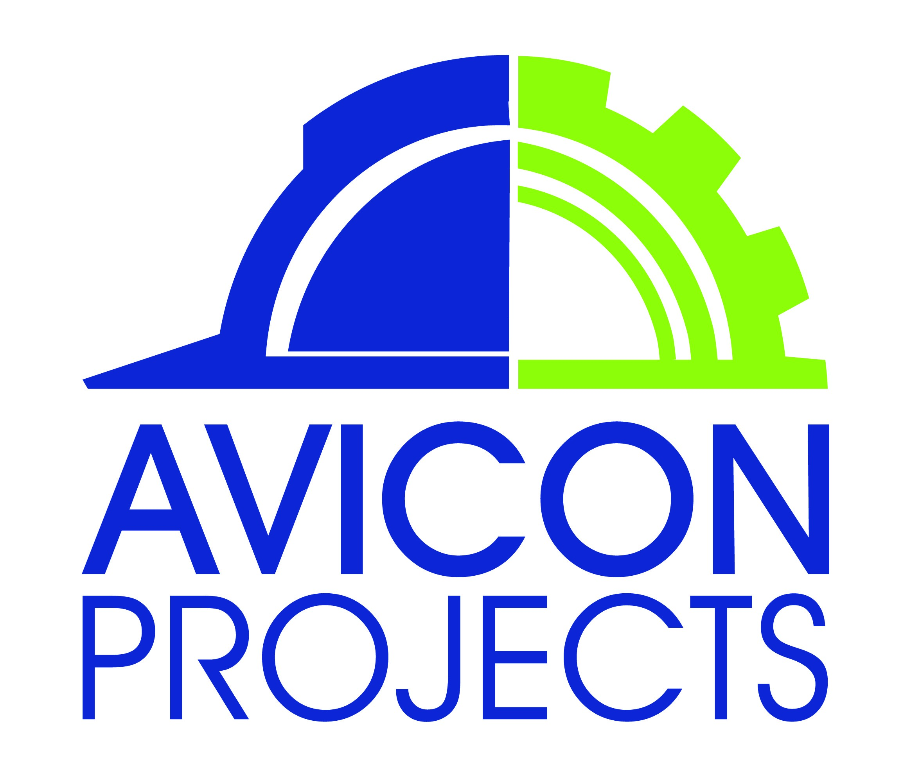

<!-- Avicon Projects company logo -->

# Welcome to Avicon Projects

> Company Description

Avicon Projects is a newly established company founded in 2017 
as a result of identifying a need in the fast-growing construction market. We're a family owned business
with a core focus on individualized services designed for any home improvement project. Each project 
is approached with enthusiasm and quality workmanship. 

**Avicon Project specializes in the folloing key areas**

- Project Management
- Home Remodeling/Renovations/Alterations 
- Residential Property Development 
- Commercial Property Development
- Electrical
- Plumbing
- Roofing Repairs
- Plastering (Stucco)
- Paving and Tiling 

> Insert images of company here

# Badges?

[Balsalmic Wireframe]()


## Installation

- All the `code` required to get started
- Images of what it should look like

### Clone

- Clone this repo to your local machine using `https://github.com/fvcproductions/SOMEREPO`

### Setup

- If you want more syntax highlighting, format your code like this:

> update and install this package first

```shell
$ brew update
$ brew install fvcproductions
```

> now install npm and bower packages

```shell
$ npm install
$ bower install
```

- For all the possible languages that support syntax highlithing on GitHub (which is basically all of them), refer <a href="https://github.com/github/linguist/blob/master/lib/linguist/languages.yml" target="_blank">here</a>.

---

## Features

## Usage (Optional)

## Documentation (Optional)

## Tests (Optional)

- Going into more detail on code and technologies used
- I utilized this nifty <a href="https://github.com/adam-p/markdown-here/wiki/Markdown-Cheatsheet" target="_blank">Markdown Cheatsheet</a> for this sample `README`.

---

## Contributing

> To get started...


## Team


## FAQ


## Support

Reach out to me at one of the following places!

- Website at <a href="http://fvcproductions.com" target="_blank">`fvcproductions.com`</a>
- Twitter at <a href="http://twitter.com/fvcproductions" target="_blank">`@fvcproductions`</a>
- Insert more social links here.

---

## Donations (Optional)

---

## License

[](http://badges.mit-license.org)

- **[MIT license](http://opensource.org/licenses/mit-license.php)**
- Copyright 2015 © <a href="http://fvcproductions.com" target="_blank">FVCproductions</a>.
