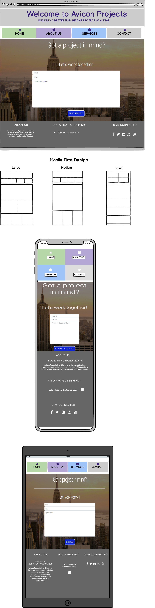

<!-- Avicon Projects company logo -->

<h1 align="center">Welcome to Avicon Projects</h1>

[View the live project here.](https://roberto-cadilhe.github.io/welcome-to-avicon-projects/)

<h2> Company Description </h2>

Avicon Projects is a newly established company founded in 2017 as a result of identifying a need in the fast-growing construction market. We're a family owned business with a core focus on individualized services designed for any home improvement project. Each project is approached with enthusiasm and quality workmanship.

### Avicon Project specializes in the folloing key areas </h3>

- Project Management
- Home Remodeling/Renovations/Alterations
- Residential Property Development
- Commercial Property Development
- Electrical
- Plumbing
- Roofing Repairs
- Plastering (Stucco)
- Paving and Tiling

<h2 align="center"></h2>

## User Experience (UX)

- ### User stories

  - #### First Time Visitor Goals

    1. As a First Time Visitor, I want to easily understand the main purpose of the site and learn more about the company.
    2. As a First Time Visitor, I want to be able to easily navigate throughout the site to find products/services.
    3. As a First Time Visitor, I want to look for customer reviews to understand what their customers think of them and see if they are trusted. I also want to locate their social media links to see their followings on social media to determine how trusted and known they are.

  - #### Returning Visitor Goals

    1. As a Returning Visitor, I want to find information about products and services.
    2. As a Returning Visitor, I want to find the best way to get in contact with the company with any questions I may have.
    3. As a Returning Visitor, I want to find previous project work completed by the company.

  - #### Frequent User Goals
    1. As a Frequent User, I want to check to see if there are any newly added products or services.
    3. As a Frequent User, I want to sign up and follow all social media accounts to stay informed about company updates.

- ### Design
  - #### Colour Scheme
    - The website consists of four main colors: blue, green, purple, and grey.
    - Avicon Projects logo colors are a bright green and blue and this is complimented by using more subdued shades of blue, green, purple, and grey throughout the website.
  - #### Typography
    - Three main font styles are used throughout the whole website with Sans Serif as the fallback font in case for any reason the fonts aren't being imported into the site correctly.
    - The three font styles are: Roboto, Rubik, and Open Sans.
    - Roboto, Rubik, and Open Sans provide a similar and modern look which is both attractive and ledgible.
  - #### Imagery
    - Imagery is important. The large, background hero image on the home page is designed to be striking and catch the user's attention. It also has a modern, energetic aesthetic and represents the industry we operate in.
    - Images are used in the About Us page to introduce new clients to the team.
    - Images are also used throughout the website to provide a visual representation of products and services and also show previous project work.

* ### Wireframes

    - ### Wireframes were created using [Balsamiq:](https://balsamiq.com/)

    - ### Home Page - 

    - ### About Us Page - 

    - ### Services Page - 

    - ### Contact Page - 

## Features

- Responsive on all device sizes and includes interactive elements

- The first page is the home page which has the company branding and includes a "Learn More" button to link to services page. This will help users clickly navigate to specific services they're looking for.

- The second page is the about us page which includes the team member information.

- The third page is the services page which lists out all of the products/services offered by Avicon. I used the hover to bring a nice blue background over each service when a client is browsing to give it extra appeal. I also have a button included for clients to "request a quote" which will lead them to the contact page to fill out a new project request.

- The fourth page is the contact page which includes a form for customers to fill out. Form has been tested.

- The header and the footer are fixed across all pages which gives the website great consistency. Included in the footer is a contact link for clients to easily submit a new project request and also links to all of our social media platforms.

## Technologies Used

### The technologies I used are:

- HTML5 is the markup language used for rendering the website. [HTML5](https://en.wikipedia.org/wiki/HTML5)
- CSS3 is the style sheet language used to style the HTML website. [CSS3](https://en.wikipedia.org/wiki/Cascading_Style_Sheets)
- Bootstrap 4 Framework for the mobile responsiveness and grid layout of the website. I also used Bootstrap's core CSS for most of the styling and layout, buttons and forms. [Bootstrap](https://getbootstrap.com/)

### Frameworks, Libraries & Programs Used

1. [Bootstrap 4.4.1:](https://getbootstrap.com/docs/4.4/getting-started/introduction/)
   - Bootstrap was used to assist with the responsiveness and styling of the website.
1. [Hover.css:](https://ianlunn.github.io/Hover/)
   - Hover.css was used on the Social Media icons in the footer to add the float transition while being hovered over.
1. [Google Fonts:](https://fonts.google.com/)
   - Google fonts were used to import the 'Titillium Web' font into the style.css file which is used on all pages throughout the project.
1. [Font Awesome:](https://fontawesome.com/)
   - Font Awesome was used on all pages throughout the website to add icons for aesthetic and UX purposes.
1. [Git](https://git-scm.com/)
   - Git was used for version control by utilizing the Gitpod terminal to commit to Git and Push to GitHub.
1. [GitHub:](https://github.com/)
   - GitHub is used to store the projects code after being pushed from Git.
1. [Photoshop:](https://www.adobe.com/ie/products/photoshop.html)
   - Photoshop was used to create the logo, resizing images and editing photos for the website.
1. [Balsamiq:](https://balsamiq.com/)
   - Balsamiq was used to create the [wireframes](https://github.com/) during the design process.

## Testing

1. Used [HTML Validator](https://validator.w3.org/) to check the markup on each page and I received the message "Document checking completed. No errors or warnings to show."

1. Used [W3C CSS Validator](https://jigsaw.w3.org/css-validator/#validate_by_input) to check CSS3 for any errors and I received the message "Congratulations! No Error Found.
This document validates as CSS level 3 + SVG ! 

1. Used [W3C Markup Validator](https://jigsaw.w3.org/css-validator/#validate_by_input) to check for markup errors.

1. I ran my page on [web.dev](https://web.dev/) and this is the [report](https://lighthouse-dot-webdotdevsite.appspot.com//lh/html?url=https%3A%2F%2F8000-eb372878-e993-461e-8447-6668e5e23b43.ws-us02.gitpod.io%2F).

1. Contact form text input fields tested and work as intended.


### Testing User Stories from User Experience (UX) Section

- #### First Time Visitor Goals

  1. As a First Time Visitor, I want to easily understand the main purpose of the site and learn more about the company.

     1. When you first enter the website you will experience a very clean home page with an easily accessibly navigation menu allowing for simple navigation between pages without confusion. The main hero image is used to not only create an interactive feeling but it also subliminally compliments the company's products and services. Within the hero image there is also a direct button titled "Learn More" directing customers to the services page. 
     2. Using large h1 header elements to indicate the main business message that we are leaders in construction innovation.
     3. The user experience here is quite simple and functional allowing the user to easily scroll and navigate to services and also find out more information in the footer which also links to the contact page for customers to quickly receive a project quote.

  2. As a First Time Visitor, I want to be able to easily navigate throughout the site to find products/services.

     1. The site has been designed with a standardized and fixed header and footer allowing for a clean and consistent feel as well as simple navigation on the user end.
     2. Immediately on the home page users are redirected to "Learn More" which links to the services page. Across all 3 pages, except the about us page, there is a button redirecting users to fill out a project request form.
     3. On the contact page, users are encouraged to describe their project din detail which allows us to better manage expectations and align with services offered. 

  3. As a First Time Visitor, I want to look for customer reviews to understand what their customers think of them and see if they are trusted. I also want to locate their social media links to see their followings on social media to determine how trusted and known they are.
     1. On the home page, immediately underneath the hero image and text, we provide customer reviews to highlight the company's success and to provide proof of products/services to new users.
     2. The customer reviews section is responsive an able to be seen on devices with screen widths of 960px and more.
     3. At the bottom of every page the footer has quick links to all the social media platforms used by Avicon Projects. This makes the UX/UI experience simple and fast. 

- #### Returning Visitor Goals

  1. As a Returning Visitor, I want to find information about products and services.

     1. It's as simple for returning visitors as it is for new users as we redirect them to the services page immediately from the home page.
     2. Our social media platforms serve as an informational tool where we highlight new project work and products and services. 

  2. As a Returning Visitor, I want to find the best way to get in contact with the company with any questions I may have.

     1. The navigation bar clearly highlights the "Contact Us" Page.
     2. Here they can fill out the form on the page and provide a detailed project description.
     3. The footer contains links to the company's Facebook, Twitter and Instagram page which are all avenues where we can be contacted on.
     4. Whichever social media link they click, it will be open up in a new tab to ensure the user can easily get back to the website.
     5. Throughout the website we have links and buttons on every page redirecting users to the contact page. 

  3. As a Returning Visitor, I want to find previous project work completed by the company.
     1. We provide images and previous project work examples across all of our social media platforms.
     2. Alternatively, users can request design samples from us as a part of our services in which we will provide more information and imagery to help customers feel more confident in our work.

- #### Frequent User Goals

  1. As a Frequent User, I want to check to see if there are any newly added products or services.

     1. Products and services will be added to the services page and any newly added products will be listed.

  2. As a Frequent User, I want to sign up and follow all social media accounts to stay informed about company updates.

     1. Our footer and socila media links are really helpful in redirecting customers and users to our external social pages in which they will be able to sign up and follow our progress. 
     2. This also allows for less confusion on the website with less text and more conscise information which for the industry we're in is a key component.

 
### Further Testing

- The Website was tested on Google Chrome, Internet Explorer, Microsoft Edge and Safari browsers.
- The website was viewed on a variety of devices such as Desktop, Laptop, iPhone7, iPhone 8, iPhoneX & iPad to manage responsiveness. 
- A large amount of testing was done to ensure that all pages were linking correctly.
- Friends, work colleagues, and family members were asked to review the site and documentation to point out any bugs and/or user experience issues.

## Deployment

### GitHub Pages

The project was deployed to GitHub Pages using the following steps:

1. Log in to GitHub and locate the [GitHub Repository](https://github.com/Roberto-Cadilhe/welcome-to-avicon-projects)
2. At the top of the Repository (not top of page), locate the "Settings" Button on the menu.
3. Scroll down the Settings page until you locate the "GitHub Pages" Section.
4. Under "Source", click the dropdown called "None" and select "Master Branch".
5. The page will automatically refresh.
6. Scroll back down through the page to locate the now published site [site link](https://roberto-cadilhe.github.io/welcome-to-avicon-projects/) in the "GitHub Pages" section.

### Forking the GitHub Repository

By forking the GitHub Repository we make a copy of the original repository on our GitHub account to view and/or make changes without affecting the original repository by using the following steps...

1. Log in to GitHub and locate the [GitHub Repository](https://github.com/Roberto-Cadilhe/welcome-to-avicon-projects)
2. At the top of the Repository (not top of page) just above the "Settings" Button on the menu, locate the "Fork" Button.
3. You should now have a copy of the original repository in your GitHub account.

### Making a Local Clone

1. Log in to GitHub and locate the [GitHub Repository](https://github.com/Roberto-Cadilhe/welcome-to-avicon-projects)
2. Under the repository name, click "Clone or download".
3. To clone the repository using HTTPS, under "Clone with HTTPS", copy the link.
4. Open Git Bash
5. Change the current working directory to the location where you want the cloned directory to be made.
6. Type `git clone`, and then paste the URL you copied in Step 3.

```
$ git clone https://github.com/Roberto-Cadilhe/welcome-to-avicon-projects.git
```

7. Press Enter. Your local clone will be created.

```
$ git clone https://github.com/Roberto-Cadilhe/welcome-to-avicon-projects.git
> Cloning into `CI-Clone`...
> remote: Counting objects: 10, done.
> remote: Compressing objects: 100% (8/8), done.
> remove: Total 10 (delta 1), reused 10 (delta 1)
> Unpacking objects: 100% (10/10), done.
```

Click [Here](https://help.github.com/en/github/creating-cloning-and-archiving-repositories/cloning-a-repository#cloning-a-repository-to-github-desktop) to retrieve pictures for some of the buttons and more detailed explanations of the above process.

## Credits

### Code

- [StackOverflow post](https://stackoverflow.com): Used to find relevant answers and support.

- [W3Schools](https://www.w3schools.com/): W3Schools library used for html layout and key components such as forms, buttons, layout etc.

- [Bootstrap4](https://getbootstrap.com/docs/4.4/getting-started/introduction/): Bootstrap Library used throughout the project mainly to make site responsive using the Bootstrap Grid System.

- [Atom Editor](https://atom.io/): Atom Editor was used to copy code for debugging. This was extremely helpful when working with media queries.

- [DarkCode](https://www.youtube.com/channel/UCD3KVjbb7aq2OiOffuungzw) and [Webflow](https://www.youtube.com/channel/UCELSb-IYi_d5rYFOxWeOz5g): Video tutorials used to help with styling ideas and layout.

### Content

- All content was written by the developer.

### Media

- All Images were created or sourced by the developer.

- Logo was developed using [Photoshop](https://www.adobe.com/ie/products/photoshop.html) 

- Team member images, customer review images, and the services hero image were taken by the developer.

- Hero image for the home page and contact page were sourced through [GoogleImages](https://images.google.com/).

### Acknowledgements

- My Mentor, Nishant Kumar,  for the continuous helpful feedback and multiple mentor sessions.

- Tutor support at Code Institute for their support.

- Slack Community and the user-centric-frontend channel for the support and quick links.  

- Lynn University colleagues and faculty support.
